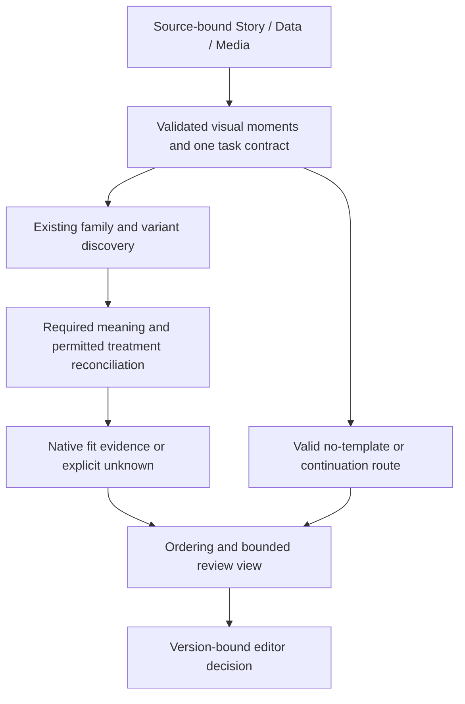

# Job 8 — Integrated root cause and repair proposal

**PASS — final audit proposal complete. Implementation is not started.** The architecture’s ownership boundaries are broadly appropriate. Its current consumers do not preserve and enforce those boundaries consistently. Repair the existing contracts and execution path before adding more ranking sophistication or rebuilding components.

[Staged repair plan](../../plans/ASTRA_MATCHING_REBUILD_PLAN.md) · [Machine-readable proposal](08-root-cause-and-redesign.json) · [Acceptance receipt](08-acceptance.json)

## Ranked causes

Impact is the consequence of a defect; recurrence is observed evidence, not an estimate of all future stories. Confidence describes the causal evidence, never permission to select or render.

### 1. Task meaning is changed or incompletely reconciled before admission

The wrong visual demand makes later ranking optimize the wrong pool. Exact authored subspan is expanded; reference occurrences trigger false plurality; distinct rates/shares merge; evidence/relationship duties are inconsistently consumed.

**Impact:** critical. **Recurrence:** Multiple stories and independent subspan, merge, keyword and participant probes. **Confidence:** high for observed failures; prevalence outside audited cases unknown.

Evidence: `02:F02,F03,F04,F06;04:F02,F03,F04,F05,F07`. Editor records: `ev_76144b97f6b04467`, `ev_197e8df3cdb679e1`, `ev_ae89ed37733a21e4`, `ev_063fd655708a1b49`.

### 2. Consumers reconstruct different task contracts and routes

Gallery, focused review and general requirements consume different projections. A correct route can disappear when task fields are omitted; no-template is mislabeled as missing candidate.

**Impact:** critical. **Recurrence:** Actual focused consumer adds 22 families to each of 12 route-ineligible tasks; independent quote-route probe. **Confidence:** high for the tested paths.

Evidence: `03:G05,G07,G08;06:C06-01,C06-08,C06-11`. Editor records: `ev_805456ee8bf50f03`, `ev_1474531742be97a8`.

### 3. Receipt presence and structural validity are mistaken for task-bound evidence

The general path can claim bound requirements without content coverage. Existing schema and immutable hashes are useful but must validate the meaning and coverage of consumed assignments.

**Impact:** critical. **Recurrence:** Empty hashed handoffs mark 73 data-required and 104 media-required tasks bound; altered receipts/values and stale adapter probes pass. **Confidence:** high for acceptance defects; factual error prevalence unmeasured.

Evidence: `03:G02,G03,G04,G09,G10,G12;04:F01`.

### 4. Capability metadata and admission rules do not expose permitted treatments consistently

A broad data union admits weak discovery candidates while missing scope compatibility and optional/required encoding distinctions hide plausible families.

**Impact:** high. **Recurrence:** 442 records, 11 without capability; both timeline scenes fail scope; qualitative spatial/variant contradictions. **Confidence:** high for metadata/predicate mismatch; native fit remains unknown.

Evidence: `05:G05-01,G05-02,G05-03,G05-04,G05-05,G05-06;06:C06-04`. Editor records: `ev_de698031ae7624db`, `ev_0125568cf745b6da`, `ev_5b014d59e8746769`.

### 5. Family selection and display truncation precede complete treatment reconciliation

One family representative is chosen before feasibility, even in exhaustive-family mode. Display omission is not evidence that a family or variant cannot fit.

**Impact:** high. **Recurrence:** 60 review-record replays: 5,788 sibling suppressions, 232 slide-cap and 1,168 display-limit omissions; no duplicate-family flooding observed. **Confidence:** high for stage order; omitted valid-fit count unknown.

Evidence: `06:C06-02,C06-03,C06-06;05:G05-08,G05-09`. Editor records: `ev_5d60ed543cb6a6c2`, `ev_370b72a9900c6e92`.

### 6. Media demand and supply are not consistently reconciled per treatment

Good template choices and wrong media, or good media and wrong pairing, are separate outcomes. Missing assets must produce a precise sourcing gap rather than a false template verdict.

**Impact:** high. **Recurrence:** Three explicit mediaNeeds proposals marked not-required; current general handoffs lack task coverage; scoped historical supply/framing failures. **Confidence:** high for contract gap; current availability must be checked fresh.

Evidence: `03:G05,G06,G08;07:media_identity_and_supply,media_eligibility`. Editor records: `ev_0183c99a16600ab0`, `ev_84d8227c5595ac1a`, `ev_65fa5e81c76d4c01`.

### 7. Review and run provenance is insufficient for reliable causal evaluation

Feedback can be applied to the wrong task representation and historical order cannot be reproduced. Audit-only sidecars fix analysis, not production export.

**Impact:** high. **Recurrence:** 33/60 normalized current contexts used a different gallery; historical intermediate scores/pool absent; Job 4 catalog attribution corrected by Job 5. **Confidence:** high.

Evidence: `01:J1-E01,J1-E02,J1-E03;05:G05-11;06:C06-09;07:contextualSummary`. Editor records: `ev_160840d04b878840`.

### 8. Evaluation measures structural completion more reliably than editor-quality correctness

Signature coverage, passing fixtures and intact fields are not independent quality acceptance. Review sampling merges meaningful differences and reviewed stories are no longer untouched tests.

**Impact:** high. **Recurrence:** Gold boundary matches 307 Future/113 Year; 439 heterogeneous review records; held-out fixture has unresolved fits and pending human approval. **Confidence:** high for measurement limits; repair quality remains untested.

Evidence: `06:C06-07;07:goldSummary,balancedSuccessFailureSet,countsAreNotErrorRates`. Editor records: `ev_9968d9e53524c9b1`, `ev_0c2a0aba000bca29`.

## What to retain, repair and retire

| Disposition | Component | Reason |
|---|---|---|
| retain | StoryPackage, shared registry, adapter and immutable source spans | They preserve source identity and supported semantic fields; all 11 inspected fields survive adaptation. |
| repair | Existing splitter and task materialization | Use exact subspans; reconcile required meaning before proposing merges/splits; retire keyword/character-count authority after parity tests. |
| retain_and_repair | General contract gate and harness | Retain registered entry-point checks; add current-artifact content/freshness/ordered-stage receipts, distinguishing fixture tests from per-run proof. |
| retain_and_connect | Existing richer matching handoff, visualtask_requirements and batch fit | Generalize source-bound consumption; remove duplication in simplified public requirements after tested migration. |
| retain_and_repair | Approved catalog, capability sidecars, native technical index and composition mappings | Evidence already exists. Correct scope, encode reviewed variant/adjustment facts and carry unknowns; do not replace the library. |
| retain_with_reordered_use | C.diversify and local semantic ordering | Use after requirement/treatment reconciliation; group variants for review without discarding their evidence. Similarity remains ordering only. |
| replace_duplicate_projection | Gallery/focused task reconstruction | Both must consume one canonical source-bound task contract; remove local re-derivation once equivalence and omission tests pass. |
| retain_and_repair | Focused queue and review/evidence export | Sampling remains a view, not a validation shortcut; bind exact gallery and review history; expose hidden valid/unknown alternatives. |
| retain_with_narrow_extension_proposed | Provider-neutral agent task/profile/runner and semantic proposal schema | Existing operational runner currently supports a Codex CLI review path, not general semantic proposal activation. Reuse its contracts; any semantic-proposal operation requires explicit scoped interface review before implementation. |
| remove_from_new_path_after_migration | Legacy binding admission, keyword-only operation authority and fixture-pass-as-run-success | Keep historical readers and archived evidence. Remove only verified live decision dependencies that the staged replacement covers; do not delete historical data. |

No evidence supports a wholesale platform rewrite. The adapter preserves inputs; no duplicate-family flooding or global-pick leakage appeared in the tested gallery path. The shared registry and native evidence stores should remain. Failures in meaning, task propagation and fit-before-display explain more than a weak similarity model alone. Provider/model replacement has not been demonstrated necessary.

## Unambiguous concepts

- **beat:** Ordered narrative container with exact script spans and speaker/section context; not automatically one shot.
- **claim:** Source-grounded semantic assertion or attributed utterance with exact span and provenance; a punctuation sentence may contain several.
- **semantic visual moment:** Smallest coherent presentation interval whose required meanings can be satisfied together by an existing treatment or explicit route; can cross claims or use a subspan.
- **visual job:** Template-neutral communicative relationship/action required in that moment; not a template name or broad subject.
- **presentation contract:** Validated account of required meanings, participants, exclusions, readability, order, evidence and route constraints for a moment, derived without inventing facts.
- **template capability:** Versioned evidence about an existing family/variant and supported controls, separating observed sample behavior from verified editable range.
- **candidate:** Existing template plus a specific permitted treatment plan under consideration, with explicit compatible/incompatible/unresolved outcomes; neither selected nor proven fit merely by retrieval.
- **route:** Typed disposition such as existing template, exact source footage, b-roll, still/cutout with supported text treatment, continuation, or unresolved; no-template can be correct.
- **review evidence:** Authored decision/comment bound to exact displayed task/candidate/version, source order, scope and status; separate from model judgments or derived summaries.
- **native fit:** Task-bound evidence that the exact existing composition/control plan can meet content, timing and readability requirements; a slot count, tag or mapping alone is insufficient.

## Ownership and contracts

Prefer filling and consuming current fields over widening schemas. Job 3 proposed no new upstream fields for its twelve proven gaps. The first step is exact validated coverage of what already exists.

- **story:** Narration, semantic assertions, speaker roles, intended relationships, withholding, continuity and exact source spans. Inputs: Authored script and source evidence. Outputs: Existing StoryPackage claims/obligations/entityRefs/speaker/timing populated or typed unresolved; revised packages for semantic corrections. Boundary: Does not choose templates, create asset supply or validate Data calculations.
- **data:** Stable entity/cohort resolution, metric/unit/basis, methods, typed values and verifiable receipts. Inputs: Source-bound claims and supported source tables. Outputs: Existing task/claim-bound assignments with selectors, columns, transforms and source digests, or missing/unsupported state. Boundary: Unknown is not zero; text presence is not verified fact; no inference from template demo content.
- **media:** Assets, identity/framing/kind, provenance/rights/lifecycle and current availability. Inputs: Task meaning plus candidate treatment-specific asset demands. Outputs: Eligible asset IDs and evidence or exact unmet sourcing brief; digest-bound supply snapshot. Boundary: Does not invent missing assets or reject a communication-capable template solely because an asset is absent.
- **matching:** Visual moment proposal reconciliation, presentation contract, existing-template discovery, treatment feasibility, route/sequence planning and review lineage. Inputs: Validated Story/Data/Media evidence and versioned existing catalog. Outputs: Auditable candidate+treatment assessments and valid no-template/unknown routes, then review display. Boundary: Cannot invent Story intent/Data facts/Media availability or use similarity/human preference as native-fit proof.
- **editor:** Narrative intent ambiguities, taste, scoped treatment approval and promotion of reviewed evidence. Inputs: Concrete bounded alternatives with original source reference, adjustment evidence and unresolved gaps. Outputs: Version-bound scoped decisions or explicit approval of proposed changes. Boundary: No routine request to resolve facts the code/source can determine; no inferred approval from silence.

## Smallest architecture

Model proposes source-cited semantic moments/requirements through existing structured proposal workflow and provider-neutral task/profile contracts. Deterministic code validates exact spans, referential integrity, no missing claims, required invariants, scope, current evidence and permitted activation. Models do not verify facts by assertion or approve native fit. Existing runner supports Codex review; multi-provider/semantic-operation execution is not claimed implemented.

The model’s semantic reasoning is a proposal source, not an authority substitute. Required additional meaning is reconciled explicitly; incidental secondary cues do not union unrelated template pools. Unknown memberships, assets and native controls stay unknown. A candidate is assessed with its specific allowed adjustment plan; unsupported recutting is not assumed.

## Capability authorship, grammar and versioning

Reuse existing intake/video/native inspection systems: raw observation → proposed correction/variant controls → native/editor review where required → versioned active record. Retain source project/clip hash, composition mapping, supported control bounds, reviewer and supersession history. Invalidate dependent receipts on changes; missing fonts substitute-and-flag, incompatible host version is a per-project flag. No original template is rebuilt.

Use a compact story-neutral vocabulary that distinguishes relationship, readable evidence, order, quantitative relation, simultaneous versus total identity demand, and required versus optional encoding. Existing legacy jobs may remain compatibility labels. Demo labels are not mandatory visual structure. New vocabulary such as reduction-to-subset must name observable behavior and receive reviewed evidence; no automatic conversion of prose into verified capability. Scope restrictions remain hard constraints.

## Staged migration and evaluation

The plan contains P0–P7 with owners, inputs, outputs, migrations, test-first acceptance, rollback, dependencies and evidence. Start with regression evidence, truthful bindings and shared task propagation. Semantic proposal changes and capability updates follow; full treatment reconciliation precedes display changes. Final quality promotion uses actual-run receipts and an untouched package. No rollout is authorized by this report.

- **positive_candidate_recall:** Recovered editor-accepted task+treatment alternatives / all adjudicated valid alternatives in the version-bound set. Report discovery, admission, reconciled and displayed recall separately; unknown native fit is a separate denominator. 100% on agreed critical regression alternatives; held-out minimum must be agreed before exposure.
- **negative_candidate_rejection:** Rejected incompatible task+treatment alternatives excluded at the appropriate stage / all adjudicated incompatible alternatives; report false exclusion of valid alternatives separately. 100% on explicit hard-constraint regression negatives; review subjective negative thresholds before evaluation.
- **family_and_variant_coverage:** Distinct compatible families/meaningfully different variants reached versus independently adjudicated expected set; same-family duplicate cards and hidden alternatives also reported. No silent loss of a validated alternative before display; display capacity is explicit, overflow remains accessible.
- **no_template_correctness:** Correctly preserved intentional no-template/clip/continuation routes and zero forced-template suggestions; separately test tasks wrongly suppressed from template discovery. All deterministic route fixtures pass; no-template does not claim media availability.
- **semantic_fidelity:** Exact span coverage, role/participant/unit/relationship preservation; separately adjudicated split/merge appropriateness. Zero omitted/invented narration and zero withholding violation; editorial segmentation judged with both split and keep counterexamples.
- **native_evidence_integrity:** False native-fit assertions; stale/missing mapping, timing, copy and asset evidence; unknown-to-rejected coercions. Zero unsupported native-fit claims and zero unknown-to-exhausted transitions.
- **review_effort:** Median/p90 review minutes, cards inspected, unresolved decisions and reopened cases per completed task, with coverage/quality held constant. Baseline to be measured; editor sets improvement target before rollout, no invented time savings.
- **generalization_and_reproducibility:** Same-artifact replay identity, provider response validation, subject-name paraphrase/renaming checks and genuinely untouched package quality. Deterministic fixtures and dependency hashes pass; quality thresholds frozen before held-out review.

## Evidence limits and corrections

- Original-video frame-level mapping not supplied.
- 439 records are heterogeneous scoped evidence, not an accuracy denominator.
- 60 review records cover 59 tasks; omitted candidate counts are not proven valid-fit losses.
- 431 capability-bearing records flag native_editability unknown; catalog metadata is not native-fit proof.
- Use Job 5 correction for Job 4 catalog source: local export SHA 96a699ae623ad00e19680e58256734bb6519fa1cc087d310d39f03cf8d4a843e.
- Provider-assisted semantic quality gains and effort savings remain hypotheses to test.

The 30 Year Seventeen visual-job cases and both gold task references are available; a separate original-video visual map remains unprovided. This limits exact source-video visual-fidelity claims, not the demonstrated code/contract repairs. Human evidence is scoped and includes contradictions, later qualifications and non-template successes. No individual comment becomes runtime policy.

## Audit sources

- [Job 1](01-system-map.md) — SHA-256 `04a32a692d70d7e3acb0edf2e8f22d6f8101ca0cb13c1f1ef0dc64eb1047df42` (JSON authority).
- [Job 2](02-story-semantics.md) — SHA-256 `e4e77448e055b61dd2471ff61ba3b28d29efb1ef95701b04832fdae49a969ecd` (JSON authority).
- [Job 3](03-upstream-contract-fitness.md) — SHA-256 `c60de914c7f1a6c1c1d50f8d8f75d38e5867659e966c713dea7b4ee8d1261e67` (JSON authority).
- [Job 4](04-matching-transformations.md) — SHA-256 `38173955cfc9c64efeaad6fb17929851b7f47b1e995a3ca9733c6a22d92b253e` (JSON authority).
- [Job 5](05-grammar-capability-audit.md) — SHA-256 `45239e699adf2b71baec7f15c29f2d7ec7e81b8a215f8e63c5bc4e99e7b43038` (JSON authority).
- [Job 6](06-candidate-pipeline.md) — SHA-256 `18fe3546468a47fc46d2db059a7fd40085045d19bb08f9713f07af0906eb4203` (JSON authority).
- [Job 7](07-human-evidence-analysis.md) — SHA-256 `46bd8f33da7b48a7eb8dcc2b8b092e383c560461e1f89ab8d6755015a32eb94e` (JSON authority).

## Editor review required

Please review [ASTRA_MATCHING_REBUILD_PLAN.md](../../plans/ASTRA_MATCHING_REBUILD_PLAN.md). The recommended first scope is P0–P2; approving later work should follow review of those concrete results. Job 8 explicitly says implementation cannot begin until the editor reviews this plan. New custom implementations also remain subject to the workspace’s existing-systems-first rule.

**Next action: editor review. Blocker owner: `you` for implementation approval. All eight audit jobs are complete; no further implementation job has started.**
